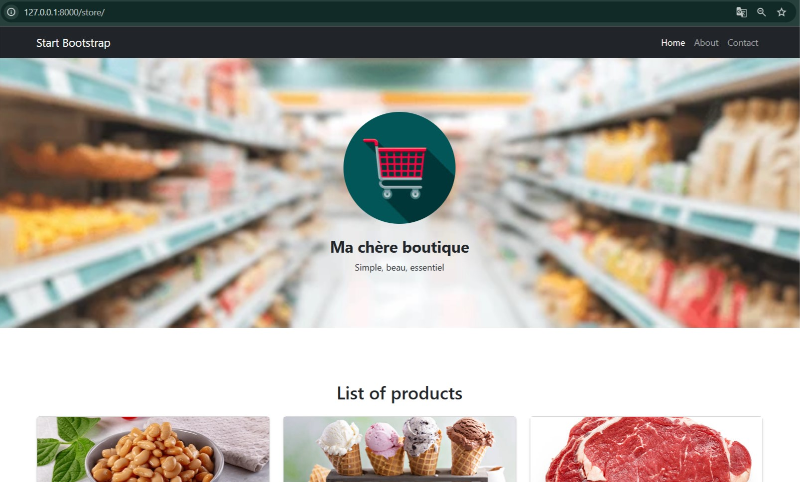

# Coding Weeks Project - Site Ma chère boutique



## Project Description
This project is part of the Coding Weeks 2025 initiative. It is a web application designed to manage and showcase a store's inventory and operations. The application is built using Django, a high-level Python web framework.

## Features
- User authentication and management
- Store inventory management
- Dynamic web pages with templates
- Database integration with SQLite

## Setup Instructions
1. Clone the repository:
   ```
   git clone <repository-url>
   ```
2. Navigate to the clone directory:
   ```
   cd saclay-local
   ```
3. Create and activate a virtual environment:
   ```
   python -m venv venv
   .\venv\Scripts\activate  # For Windows
   source venv/bin/activate  # For macOS/Linux
   ```
4. Install the required dependencies:
   ```
   pip install -r requirements.txt
   ```
5. Navigate to the project directory:
   ```
   cd saclay_local
   ```
6. Apply database migrations:
   ```
   python manage.py migrate
   ```
7. Run the development server:
   ```
   python manage.py runserver
   ```

## Usage
- Access the application in your web browser at `http://127.0.0.1:8000/`.
- Use the admin panel at `http://127.0.0.1:8000/admin/` to manage the store (requires admin credentials).

## Folder Structure
- `saclay_local/`: Contains project settings and configurations.
- `store/`: Contains the main application logic, including models, views, and templates.
- `templates/store/`: Contains HTML templates for the store application.

## License
This project is licensed under the MIT License. See the LICENSE file for details.

## Acknowledgments
Special thanks to the Coding Weeks 2025 organizers and mentors for their support and guidance.
